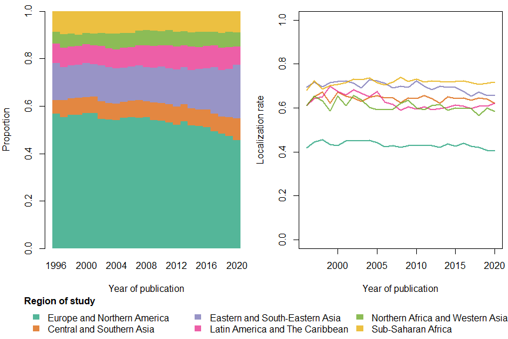
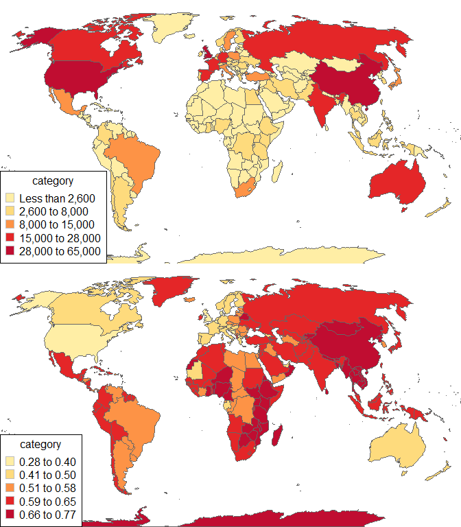
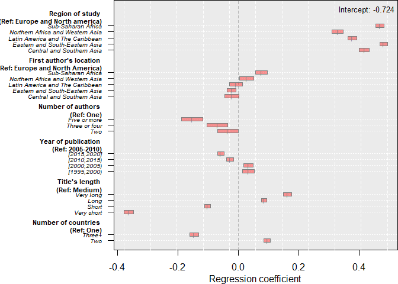
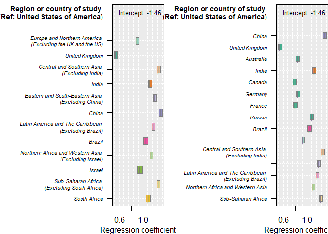

Supplementary Materials
================
Andres Castro and Diego Alburez-Gutierrez
27/01/2022

  - [Data access and availability](#data-access-and-availability)
  - [Reproducible scripts](#reproducible-scripts)
      - [FIGURE 1](#figure-1)
      - [FIGURE 2](#figure-2)
      - [FIGURE 3](#figure-3)
      - [FIGURE 4](#figure-4)
  - [Session information](#session-information)

Online supplementary materials for paper:

Castro, Andres and Diego Alburez-Gutierrez. 2022. “North and South:
Naming practices and the hidden dimension of global disparities in
knowledge production.” *Proceedings of the National Academy of Sciences*
(in press).

In this repository, we provide country-level localization rates, the
summary tables of all the linear models reported in the paper, and the
scripts (in R language) to reproduce the four figures included in the
manuscript . These materials constitute the evidential base for our
claims.

In order to access the aggregated data presented in the paper and
replicate the main finding of the paper, clone this repository to a
local directory. The data is stored in four `.RDS` files, which can be
read by the R software. All the code is in the `readme.Rmd` file, which
is rendered below.

# Data access and availability

We accessed the Scopus data provided by Elsevier thanks to the
Kompetenzzentrum für Bibliometrie. Please note that our contractual
agreement precludes us from redistributing the raw unprocessed data
(i.e., the individual-level publication records). Users interested in
accessing the microdata should contact Elsevier or the Kompetenzzentrum
für Bibliometrie directly to enquire about the conditions of access and
use (<https://www.bibliometrie.info/index.php?id=kontakt>).

# Reproducible scripts

Load packages:

``` r
library(RColorBrewer); library(rgdal); library(rworldmap); library(car)
```

    ## Warning: package 'RColorBrewer' was built under R version 4.0.3

    ## Warning: package 'rgdal' was built under R version 4.0.5

    ## Loading required package: sp

    ## Warning: package 'sp' was built under R version 4.0.5

    ## rgdal: version: 1.5-23, (SVN revision 1121)
    ## Geospatial Data Abstraction Library extensions to R successfully loaded
    ## Loaded GDAL runtime: GDAL 3.2.1, released 2020/12/29
    ## Path to GDAL shared files: C:/Program Files/R/R-4.0.2/library/rgdal/gdal
    ## GDAL binary built with GEOS: TRUE 
    ## Loaded PROJ runtime: Rel. 7.2.1, January 1st, 2021, [PJ_VERSION: 721]
    ## Path to PROJ shared files: C:/Program Files/R/R-4.0.2/library/rgdal/proj
    ## PROJ CDN enabled: FALSE
    ## Linking to sp version:1.4-5
    ## To mute warnings of possible GDAL/OSR exportToProj4() degradation,
    ## use options("rgdal_show_exportToProj4_warnings"="none") before loading rgdal.
    ## Overwritten PROJ_LIB was C:/Program Files/R/R-4.0.2/library/rgdal/proj

    ## Warning: package 'rworldmap' was built under R version 4.0.5

    ## ### Welcome to rworldmap ###

    ## For a short introduction type :   vignette('rworldmap')

    ## Warning: package 'car' was built under R version 4.0.5

    ## Loading required package: carData

    ## Warning: package 'carData' was built under R version 4.0.5

## FIGURE 1

``` r
# Reading the data
t_all<-readRDS("Data_Figure_1.RDS")[[1]]
t_pro<-readRDS("Data_Figure_1.RDS")[[2]]

# Labels and colors
xlab<-'Year of publication'
ylab1<-'Proportion'; ylab2<-'Localization rate'
c06<-scales::alpha(brewer.pal(7, 'Dark2'), .75)

# Figure layout
par(mfrow=c(1,2), mar=c(4,4,1,.5), oma=c(4,0,0,0))

# Panel A
barplot(t_pro, col=c06, border='transparent', ylim=c(0,1), xlab=xlab, ylab=ylab1, space=0)

# Panel B
plot(0, 0, xlim=c(1996, 2020), ylim=c(0,1), xlab=xlab, ylab=ylab2)
for(i in 1:length(levels(t_all$r_abregf))){ 
   lines(t_all[t_all$r_abregf==levels(t_all$r_abregf)[i], c('r_yearpu', 'r_duoutc.mean')],
         col=c06[i], lwd=2)
}

# Legend
legend(1960, -.25, fill=c06, legend=levels(t_all$r_abregf), bty='n', xpd=NA,
       title=expression(bold("Region of study")), border='transparent', ncol=3,
       title.adj=0)
```

<!-- -->

## FIGURE 2

``` r
# Reading the data, merging with world map, and using the Robinson projection
dgc<-readRDS('Data_Figure_2.RDS')
m1<-joinCountryData2Map(dgc, joinCode="ISO3", nameJoinColumn="iso3c") 
```

    ## 229 codes from your data successfully matched countries in the map
    ## 11 codes from your data failed to match with a country code in the map
    ## 14 codes from the map weren't represented in your data

``` r
robinson = CRS("+proj=robin +lon_0=0 +x_0=0 +y_0=0 +datum=WGS84 +units=m +no_defs")
m1<-spTransform(m1, CRS=robinson)

# Re-coding countries
m1@data[is.na(m1@data$total_ob), c('GEOUNIT','NAME','total_lc','total_oc')]
```

    ##                                 GEOUNIT                       NAME total_lc
    ## 8   French Southern and Antarctic Lands Fr. S. and Antarctic Lands     <NA>
    ## 39                      Northern Cyprus                  N. Cyprus     <NA>
    ## 89                               Kosovo                     Kosovo     <NA>
    ## 180                               Aland                      Aland     <NA>
    ## 183         Ashmore and Cartier Islands    Ashmore and Cartier Is.     <NA>
    ## 186                    Saint Barthelemy             St. Barthelemy     <NA>
    ## 196      Federated States of Micronesia                 Micronesia     <NA>
    ## 197                                Gaza                       Gaza     <NA>
    ## 204            Indian Ocean Territories          Indian Ocean Ter.     <NA>
    ## 207                     Siachen Glacier                       <NA>     <NA>
    ## 213                        Saint Martin                 St. Martin     <NA>
    ## 231           Saint Pierre and Miquelon    St. Pierre and Miquelon     <NA>
    ## 232               Sao Tome and Principe      Sao Tome and Principe     <NA>
    ## 235            Turks and Caicos Islands       Turks and Caicos Is.     <NA>
    ##     total_oc
    ## 8       <NA>
    ## 39      <NA>
    ## 89      <NA>
    ## 180     <NA>
    ## 183     <NA>
    ## 186     <NA>
    ## 196     <NA>
    ## 197     <NA>
    ## 204     <NA>
    ## 207     <NA>
    ## 213     <NA>
    ## 231     <NA>
    ## 232     <NA>
    ## 235     <NA>

``` r
m1@data$total_lc[m1@data$GEOUNIT=='Kosovo']<-
  m1@data$total_lc[m1@data$GEOUNIT=='Republic of Serbia']
m1@data$total_oc[m1@data$GEOUNIT=='Kosovo']<-
  m1@data$total_oc[m1@data$GEOUNIT=='Republic of Serbia']

m1@data$total_lc[m1@data$GEOUNIT=='Northern Cyprus' | m1@data$GEOUNIT=='Aland']<-
  m1@data$total_lc[m1@data$GEOUNIT=='Finland']
m1@data$total_oc[m1@data$GEOUNIT=='Northern Cyprus' | m1@data$GEOUNIT=='Aland']<-
  m1@data$total_oc[m1@data$GEOUNIT=='Finland']

# Map limits and color palette
x_coord<-c(bbox(m1)[1,1]*.75, bbox(m1)[1,2]*.9)
y_coord<-c(bbox(m1)[2,1]*.25, bbox(m1)[2,2]*.4)
c05<-brewer.pal(9, 'YlOrRd')[c(2,3,5,7,8)]

# Panel A
par(mar=c(0,0,0,0), mfrow=c(2,1))
mapCountryData(m1, nameColumnToPlot="total_oc", catMethod='categorical',
               addLegend=T, missingCountryCol="white", ylim=y_coord, xlim=x_coord,
               borderCol='gray40', numCats=5, oceanCol='white', lwd=0.01,
               mapTitle="", colourPalette=scales::alpha(c05,.95))
# Panel B
mapCountryData(m1, nameColumnToPlot="total_lc", catMethod='categorical',
               addLegend=T, missingCountryCol="white", ylim=y_coord, xlim=x_coord,
               borderCol='gray40', numCats=5, oceanCol='white', lwd=0.01,
               mapTitle="", colourPalette=scales::alpha(c05,.95))
```

<!-- -->

## FIGURE 3

``` r
# Reading the data (summary Poisson model)
sp0<-readRDS("Data_Figure_3.RDS")

# Transforming summary model into a table for plotting
s<-data.frame((sp0[[1]]$coeff))[-1,]
int<-data.frame((sp0[[1]]$coeff))[1,1]
gap<-2.8
colnames(s)<-substr(colnames(s), 1, 3)
s$p_catego<-substr(rownames(s), 9, 50)
s$p_variab<-substr(rownames(s), 1,8)
s$p_varloc<-recode(c(1, diff(as.numeric(as.factor(s$p_variab)))), "0=0; else=gap")
s$p_upperv<-s$Est + qnorm(.975) * s$Std
s$p_lowerv<-s$Est - qnorm(.975) * s$Std
s$p_yaxisp<-cumsum(rep(1, nrow(s)) + s$p_varloc); s$p_yaxisp<-max(s$p_yaxisp)-s$p_yaxisp
s$p_yaxisp<-max(s$p_yaxisp)-s$p_yaxisp
ran<-range(c(s$p_upperv, s$p_lowerv))

# Background
par(mar=c(3,10,0,0))
plot(s$Est, nrow(s):1, yaxt='n', ylab='', xlab='', type='n', 
     ylim=c(0,max(s$p_yaxisp+gap)), xlim=range(c(s$p_upperv, s$p_lowerv)))
rect(par("usr")[1], par("usr")[3], par("usr")[2], par("usr")[4], col="gray92")
abline(v=seq(ran[1], ran[2], diff(ran)/10), lty=2, col='white')
abline(v=0, lty=2, col='gray70')
abline(h=s$p_yaxisp, col='white', lty=3)
legend('topright', legend = paste0('Intercept: ', round(int, 3)), bty='n', cex=0.8)
mtext("Regression coefficient", side=1, line=2)

# Confidence intervals and point estimates
rect(s$p_lowerv, s$p_yaxisp-.3, s$p_upperv, s$p_yaxisp+.3, 
     col=scales::alpha('red',.4), border='gray50')
points(s$Est, s$p_yaxisp, pch='|', cex=.6, lwd=2, col='gray50')

# Labels
vlabs<-c("Number of countries \n (Ref: One)",
         "Title's length \n (Ref: Medium)",
         "Year of publication \n (Ref: 2005-2010)",
         "Number of authors \n (Ref: One)",
         "First author's location \n (Ref: Europe and North America)",
         "Region of study \n (Ref: Europe and North america)")
axis(2, s$p_yaxisp, s$p_catego, las=2, font=3, cex.axis=0.6)
axis(2, s$p_yaxisp[s$p_varloc==gap]+c(3,5,5,4,6,6)-.5, vlabs, las=2, tick=F, 
     cex.axis=0.7, font=2)
```

<!-- -->

## FIGURE 4

``` r
# Reading the data
sp0<-readRDS("Data_Figure_4.RDS")

# Color, labels, and aesthetics
c06<-brewer.pal(7, 'Dark2')
col<-list(c06[c(1,1,2,2,3,3,4,4,5,5,6,6)], c06[c(3,1,1,2,1,1,1,1,4,1,2,3,4,5,6)])
alp<-list(rep(c(0.4, 0.8), 6), c(rep(0.8, 9), c(rep(0.4, 6))))
list_labels<-list(c('Europe and Northern America \n (Excluding the UK and the US)',
                    'United Kingdom',
                    'Central and Southern Asia \n (Excluding India)', 'India', 
                    'Eastern and South-Eastern Asia \n  (Excluding China)', 'China',
                    'Latin America and The Caribbean \n (Excluding Brazil)', 'Brazil',
                    'Northern Africa and Western Asia \n (Excluding Israel)', 'Israel',
                    'Sub-Saharan Africa \n (Excluding South Africa)', 'South Africa'),
                  c('China', 'United Kingdom', 'Australia', 'India','Canada', 'Germany',
                    'France','Russia','Brazil',
                    'Europe and North America (Excl. top ten \n Europe, Australia, Canada, and the US)',
                    'Central and Southern Asia \n (Excluding India)',
                    'Eastern and South-Eastern Asia \n  (Excluding China)',
                    'Latin America and The Caribbean \n (Excluding Brazil)',
                    'Northern Africa and Western Asia',
                    'Sub-Saharan Africa'))

vlabs<-c("Subject area \n (Ref: Health Sciences)",
         "Number of thematic areas \n (Ref: One)",
         "Title's length \n (Ref: Very short)",
         "Year of publication \n (Ref: 1995-1999)",
         "Number of authors \n (Ref: One)",
         "First author's location \n (Ref: Europe and North America)",
         "Region or country of study \n (Ref: United States of America)")[7]

par(mar=c(3,12,0.5,0), mfrow=c(1,2)); gap<-1
for(f in 1:2){
  s<-data.frame((sp0[[f]]$coeff))[-1,]; int<-data.frame((sp0[[f]]$coeff))[1,1]
  colnames(s)<-substr(colnames(s), 1, 3)
  s$p_catego<-substr(rownames(s), 9, 50)
  s$p_variab<-substr(rownames(s), 1,8)
  s$p_varloc<-recode(c(1, diff(as.numeric(as.factor(s$p_variab)))), "0=0; else=gap")
  s$p_upperv<-s$Est + 1.96 * s$Std
  s$p_lowerv<-s$Est - 1.96 * s$Std
  s$p_yaxisp<-cumsum(rep(1, nrow(s)) + s$p_varloc)
  s$p_yaxisp<-max(s$p_yaxisp)-s$p_yaxisp
  s<-s[grep('r_abloc', rownames(s)),]
  ran<-range(c(s$p_upperv, s$p_lowerv))
  
  # Background
  plot(s$Est, nrow(s):1, yaxt='n', ylab='', xlab='', type='n', 
       ylim=c(0,max(s$p_yaxisp+gap+1)), xlim=range(c(s$p_upperv, s$p_lowerv)))
  rect(par("usr")[1], par("usr")[3], par("usr")[2], par("usr")[4], col="gray92")
  abline(v=seq(ran[1], ran[2], diff(ran)/10), lty=2, col='white')
  #abline(v=1, lty=2, col='gray50')
  abline(h=s$p_yaxisp, col='white', lty=3)
  legend('topright', legend = paste0('Intercept: ', ceiling(int*100)/100), bty='n', 
         cex=0.8)
  mtext("Regression coefficient", side=1, line=2)
  
  # Confidence intervals and point estimates
  rect(s$p_lowerv, s$p_yaxisp-.25, s$p_upperv, s$p_yaxisp+.25,
       col=scales::alpha(col[[f]], alp[[f]]), border='gray50')
  points(s$Est, s$p_yaxisp, pch='|', cex=1, col='gray50')
  
  # Legends
  llab<-list_labels[[f]]
  axis(2, s$p_yaxisp, llab, las=2, font=3, cex.axis=0.7)
  axis(2, s$p_yaxisp[s$p_varloc==gap]+2,  
       "Region or country of study \n (Ref: United States of America)", 
       las=2, tick=F, cex.axis=0.85, font=2)
}
```

<!-- -->

# Session information

``` r
sessionInfo()
```

    ## R version 4.0.2 (2020-06-22)
    ## Platform: x86_64-w64-mingw32/x64 (64-bit)
    ## Running under: Windows 10 x64 (build 18363)
    ## 
    ## Matrix products: default
    ## 
    ## locale:
    ## [1] LC_COLLATE=English_United Kingdom.1252 
    ## [2] LC_CTYPE=English_United Kingdom.1252   
    ## [3] LC_MONETARY=English_United Kingdom.1252
    ## [4] LC_NUMERIC=C                           
    ## [5] LC_TIME=English_United Kingdom.1252    
    ## 
    ## attached base packages:
    ## [1] stats     graphics  grDevices utils     datasets  methods   base     
    ## 
    ## other attached packages:
    ## [1] car_3.0-12         carData_3.0-5      rworldmap_1.3-6    rgdal_1.5-23      
    ## [5] sp_1.4-5           RColorBrewer_1.1-2
    ## 
    ## loaded via a namespace (and not attached):
    ##  [1] knitr_1.31        magrittr_2.0.1    maptools_1.1-1    maps_3.3.0       
    ##  [5] munsell_0.5.0     colorspace_2.0-0  lattice_0.20-41   R6_2.5.0         
    ##  [9] rlang_0.4.10      highr_0.8         stringr_1.4.0     fields_11.6      
    ## [13] tools_4.0.2       dotCall64_1.0-1   grid_4.0.2        spam_2.6-0       
    ## [17] xfun_0.21         htmltools_0.5.1.1 yaml_2.2.1        abind_1.4-5      
    ## [21] digest_0.6.28     lifecycle_1.0.0   farver_2.1.0      evaluate_0.14    
    ## [25] rmarkdown_2.7     stringi_1.5.3     compiler_4.0.2    scales_1.1.1     
    ## [29] foreign_0.8-81
